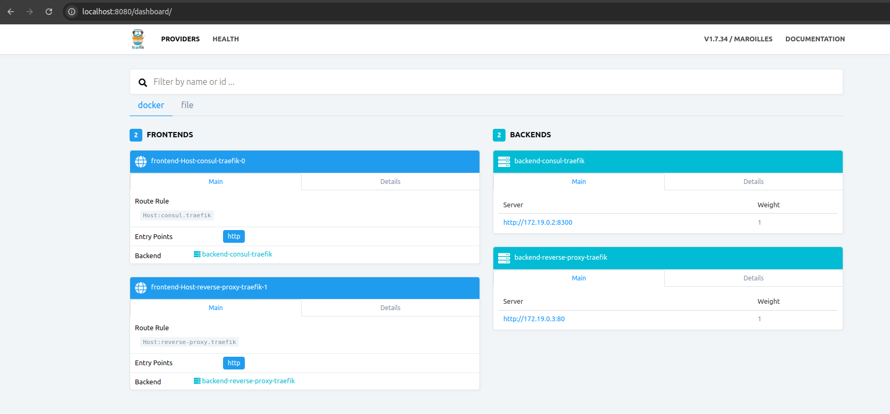

## Structure


## Steps 

### 1. Set up Consul and Traefik:

Add the necessary configuration options to the traefik.toml file.
Start it up using the docker-compose file, this will spin up both consul and traefik

Docker Commands :
```
docker-compose up
docker-compose down
```
traefik dashboard can be found in http://localhost:8080/dashboard/



### 2. Build and deploy vue web app to Spring Boot embedded tomcat
Build and bundle the Vue files using a package manager
Then copy the web file in dist folder to gateway-service:server src/main/resources/static folder
You can  do above using the gradle task under gateway-service -> tasks -> other -> ```bootRun```

### 4. StartUp both backend applications 
StartUp both core-app-service-1 and core-app-service-2

Log In to User Interface
```
username - user
password - <use generated security password on GatewayService Appliction start up by spring security>
```
User Interface can be accessed at
http://localhost:7071/gateway/index.html


### 5. Verify
Verify that your application is registered with Consul and visible in the Consul UI.
Verify that your application is accessible through Traefik by making requests to the defined endpoints.
Verify that your backend applications are routed via Zuul Gateway
