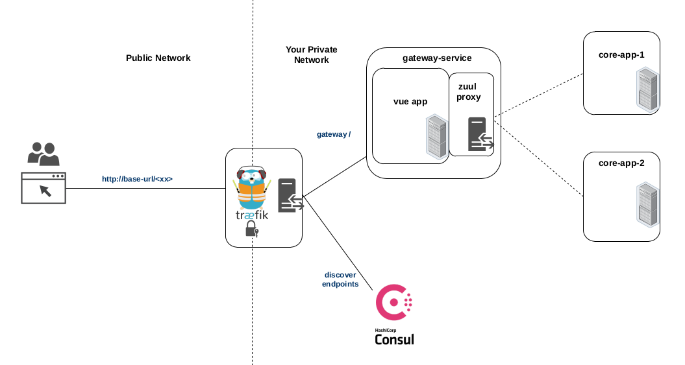

### Design



### Structure of gateway-service

gateway-service comprise 2 sub-modules
- web : this is where all the Vue files exists
  - http://localhost:7071/gateway/index.html
- server : this is the Spring Boot server app with zuul configuration
  - http://localhost:7071/gateway/index.html

### gateway-service:web project setup

#### Install
```
yarn install
```

#### Compiles and hot-reloads for development
```
yarn serve
```

#### Compiles and minifies for production

Navigate to /vue-discovery-application/gateway-service/web and run the following command

```
yarn build or npm run build
```

#### Lints and fixes files
```
yarn lint
```
